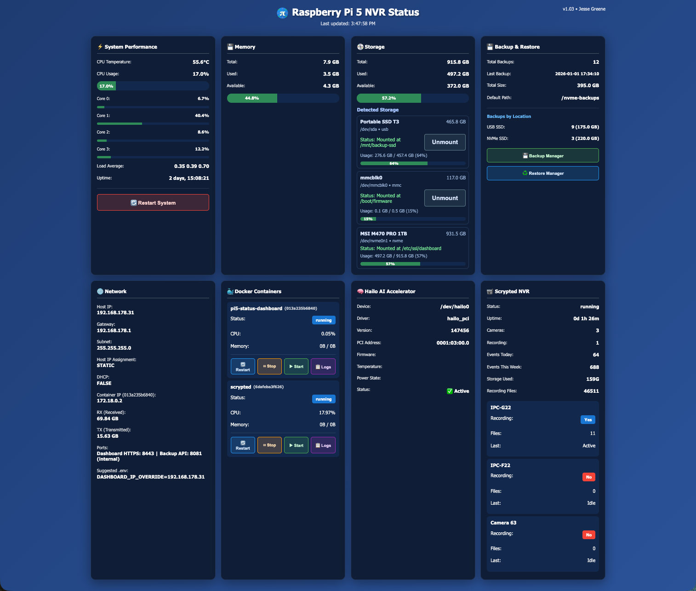
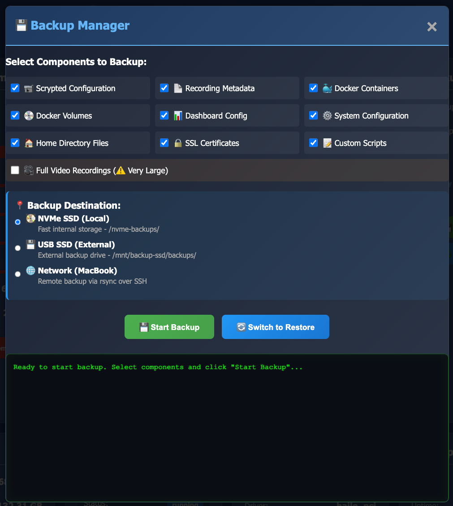
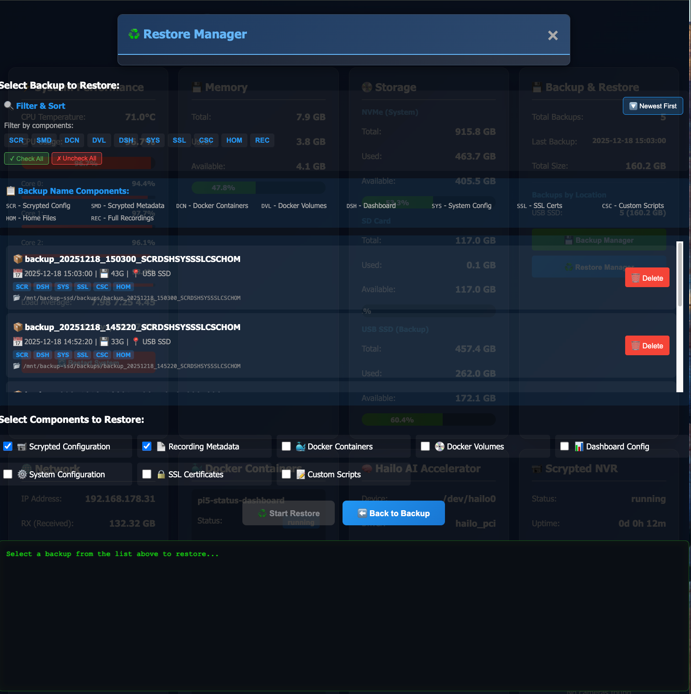

# Pi Status Dashboard (Open Source)

## About
The Pi Status Dashboard is an open-source project designed to monitor and manage Raspberry Pi setups for local NVR/edge setups. The application autodetects available hardware (e.g., NVMe, SD, USB SSD, Hailo AI, Docker, Scrypted), dynamically displays live system statistics, and provides robust backup and restore solutions with an abort option.

We welcome contributors! If you have ideas for enhancing this dashboard or adding new features aligned with its purpose, your contributions are appreciated.

---

## Features
- **Real-Time Monitoring:** Live CPU temperature and usage, memory stats, network utilization, IP details, and connected storage.
- **Hardware Discovery:** Detects and visualizes attached devices (NVMe, USB SSD, SD). Shows actual boot device and lists all detected disks with mount status.
- **Mount Control:** Inline "Mount" action for unmounted removable storage (e.g., USB backup SSD) from the dashboard.
- **Docker Integration:** Monitors running Docker containers with controls to start, stop, restart, and fetch logs.
- **Backup and Restore Management:** Initiate backups, view progress/logs, abort in-flight jobs, and restore from available backups.
- **Platform Detection:** Integrates with Hailo AI and Scrypted containers for edge processing.

## Architecture
- **Backend:** The core is written in Python (`stats_api.py`), serving via HTTPS and heavily interacting with local machine stats via `psutil` and Docker.
- **Frontend:** Vanilla HTML, CSS, and JavaScript to deliver a simple and intuitive user interface.
- **Backup Engine:** Combines Python APIs and bash scripts to handle backup/restore tasks efficiently.

## Contributing
We believe in collaboration and making technology better, together. To contribute:

1. **Fork the Repository:**
   - Visit this project’s [GitHub repository](https://github.com/JFG3rd/PI-Status-Dashboard) and click "Fork."

2. **Create a New Branch:**
   - Use a descriptive name, such as `add-hardware-xyz` or `fix-backup-bug`.

3. **Build and Test Your Changes:**
   - Ensure existing functionality is not broken.

4. **Submit a Pull Request (PR):**
   - Explain the purpose of your changes and how they improve the project.
   
---
## Open Source License
This project is released under the **Apache 2.0 License**. Check out the `LICENSE` for more details.

## Deployment Steps
Below are steps to deploy the Pi Status Dashboard:
```bash
cd /home/jessegreene/status-dashboard
docker compose up -d --build
```

### Default Configuration
- HTTPS on host 8443. Requires `/etc/ssl/dashboard/server.crt` and `server.key`.
- Essential mount points: `docker.sock`, `/sys,/proc`, `/dev,/boot`, and backup storage paths.

## Additional Notes
- Logs: `docker logs -f pi5-status-dashboard`
- Rebuild: `docker compose build --no-cache && docker compose up -d`
- Stats cache: updated every 5 seconds. Hardware refresh cache every 30 seconds.
- Storage API: `GET /api/storage/devices` lists detected disks and mount status; `POST /api/storage/mount` mounts an allowed target (defaults to `/mnt/backup-ssd`).
- Set environment variable overrides in `.env` as needed.

## Screenshots
- **Main Dashboard:** 
- **Backup Manager:** 
- **Restore Manager:** 
-
- Let’s build something amazing together!
